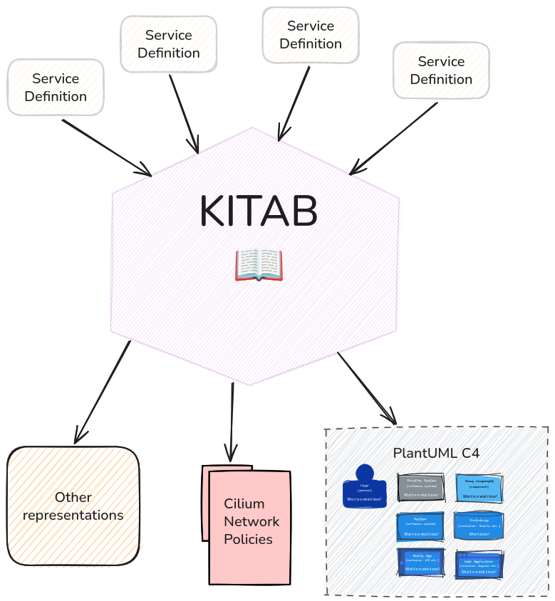
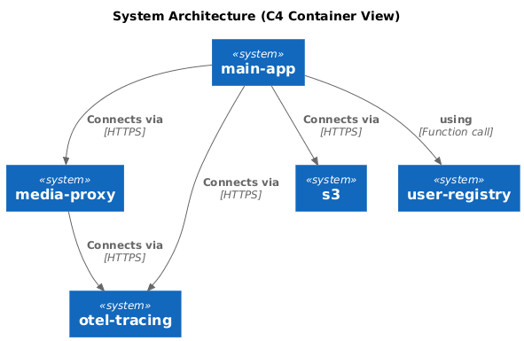

<div class="title-block" style="text-align: center;" align="center">

  <picture>
    
  </picture>

<h1> Kitab — Document and enforce your service architecture </h1>

**[Manual] &nbsp;&nbsp;&bull;&nbsp;&nbsp;**
**[Architecture] &nbsp;&nbsp;&bull;&nbsp;&nbsp;**
**[Installation]**

[Manual]: ./doc/MANUAL.md
[Architecture]: ./doc/ARCHITECTURE.md
[Installation]: ./doc/INSTALL.md

</div>

## 📖 Architecture diagrams and Network Policies from the same source of truth.

Kitab gathers service definition files and creates a graph of your infrastructure

The files are written in [KDL](https://kdl.dev), a pleasant document language that avoids the numerous footguns of YAML.

<picture>
  
</picture>

## ⚙️ In Action

Let's take the following KDL document:

```kdl
// A context represents a system boundary, like a Kubernetes cluster.
// When generating Cilium policies, services within the cluster
// will be mentioned by their name ("my-app", "media-proxy")
// whereas outside services will be referred to by their FQDN.
context "k8s"

// Services that live inside the cluster are labelled with "k8s"
// and declare their dependencies to other services.
service "media-proxy" {
	in-context "k8s"

	call "pngquant"

    // This creates a relation between `media-proxy` and `opensearch`.
	depends-on "opensearch" {
    // And we label this edge with the connection method.
		via "https"
	}

	depends-on "otel-tracing" {
		via "https"
    // Ports are optional, and there can be many of them.
    // If no ports are specified by the caller, the callee's ports are used.
    port 4317
	} 

	access "host"

	depends-on "mailgun" {
		via "smtps"
	}
}

// Services that we run outside of the cluster are not labelled
// with a context, and get a Fully Qualified Domain Name (FQDN) instead.
service "otel-tracing" {
	fqdn "tracing.internal.network"
	port 4317
	port 4318
}

service "opensearch" {
	fqdn "opensearch.internal.network"
	port 443
}

service "s3" {
	fqdn "s3.amazonaws.com"
	port 443
}

service "mailgun" {
	fqdn "smtp.eu.mailgun.org"
	port 465
}

service "user-registry" {
	in-context "k8s"
}

service "main-app" {
	in-context "k8s"

	depends-on "user-registry" {
    // This is a sub-system of the `main-app` service,
    // which is accessed by function calls.
		via "function-call"
	}

	depends-on "s3"  {
		via "https"
	}

	depends-on "media-proxy" {
		via "https"
	}

	depends-on "otel-tracing" {
		via "https"
		port 4317
	}

	depends-on "mailgun" {
		via "smtps"
	}
}

// We declare external executable that can be used at runtime by the service.
// They are not strictly necessary but can be useful to determine at a glance
// if you might be impacted by a CVE.
tool "pngquant"

// Entities are abstract concepts that are specially used by renders.
// We use this "host" to talk about the Kubernetes node host of a pod.
entity "host"  {
	in-context "k8s"
	port 123 "UDP"
	port 30928 "TCP"	
}
```

We will get the following PlantUML syntax:

```puml
@startuml
!include https://raw.githubusercontent.com/plantuml-stdlib/C4-PlantUML/master/C4_Container.puml

title System Architecture (C4 Container View)

' --- Contexts ---
Container(s3, "s3")
Container(otel_tracing, "otel-tracing")
Container(opensearch, "opensearch")
Container(mailgun, "mailgun")
Container(host, "host")
Container_Boundary(k8s, k8s) {
  Container(user_registry, "user-registry")
  Container(media_proxy, "media-proxy")
  Container(main_app, "main-app")
  Container_Boundary(media-proxy, media-proxy) {
    Container(pngquant, "pngquant")
  }
}

' --- Relationships ---
Rel(main_app, mailgun, "smtps")
Rel(main_app, media_proxy, "https")
Rel(main_app, otel_tracing, "https")
Rel(main_app, s3, "https")
Rel(main_app, user_registry, "function-call")
Rel(media_proxy, host, "https")
Rel(media_proxy, mailgun, "smtps")
Rel(media_proxy, opensearch, "https")
Rel(media_proxy, otel_tracing, "https")

@enduml
```

Which gives us this schema:



And the following Cilium Network Policy for the `media-proxy` service (amongst others)

```yaml
---
apiVersion: "cilium.io/v2"
kind: CiliumNetworkPolicy
metadata:
  name: "media-proxy-network-policy"
spec:
  endpointSelector:
    matchLabels:
      app: "media-proxy"
  egress:
    - toEndpoints:
        - matchLabels:
            io.kubernetes.pod.namespace: "kube-system"
            k8s-app: "kube-dns"
      toPorts:
        - ports:
            - port: "53"
              protocol: UDP
          rules:
            dns:
              - matchPattern: "*"
    - toFQDNs:
        - matchName: "opensearch.internal.network"
          toPorts:
            - ports:
                - port: "443"
                  protocol: TCP
    - toFQDNs:
        - matchName: "tracing.internal.network"
          toPorts:
            - ports:
                - port: "4317"
                  protocol: TCP
    - toFQDNs:
        - matchName: "smtp.eu.mailgun.org"
          toPorts:
            - ports:
                - port: "465"
                  protocol: TCP
    - toEntities:
        - host
      toPorts:
        - ports:
            - port: 123
              protocol: UDP
            - port: 30928
              protocol: TCP

```
